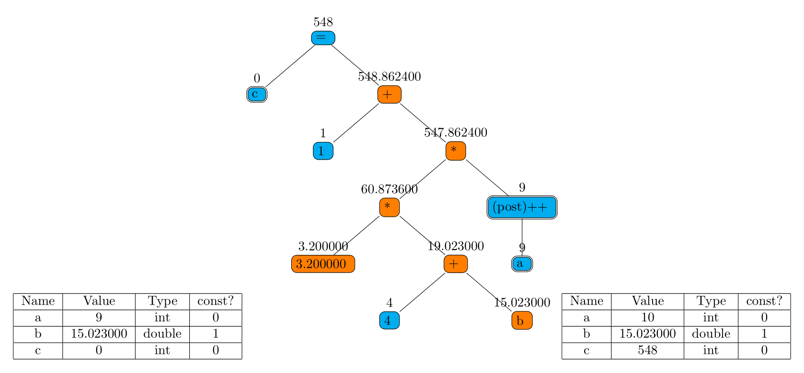
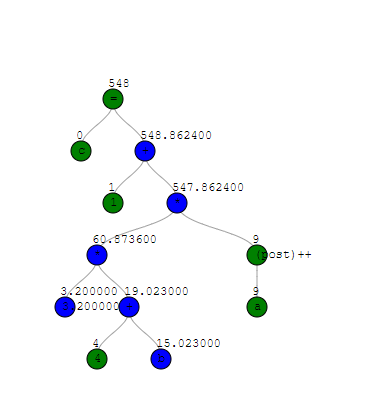

# Expressionviewer for ANSI-C / C89

## Usage
Process arguments:
* -expr "\<my expr\>": The expression to parse
* -d3: Print JSON output to stdout
* -tex: Print tex output to stdout
* -d3_file "\<filename\>": Write JSON output to file
* -tex_file "\<filename\>": Write tex output to file

If both flags -d3 and -tex are set, both outputs will be written to stdout (tex output first).

## Web installation
Copy all files from web/ and the build artifact which has to be named "c-nodes.out" to your website source folder (nginx default /var/www/html). PHP FastCGI must be enabled (tested with php-fpm).

## Examples
### c = 1 + 3.2 * (4 + b) * a++
#### To include in a .tex file

#### SVG representation
